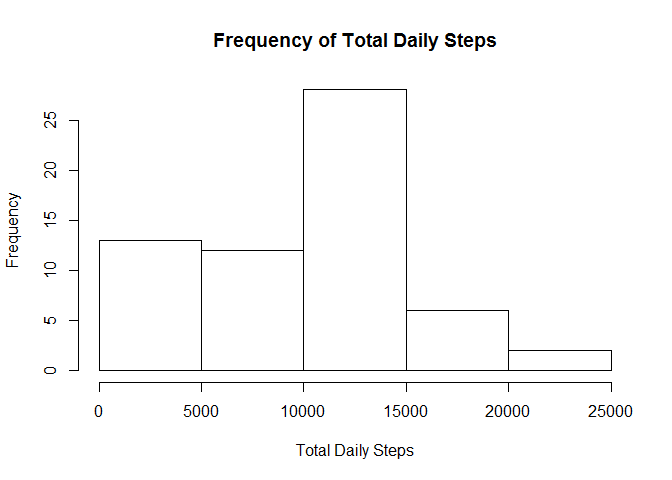
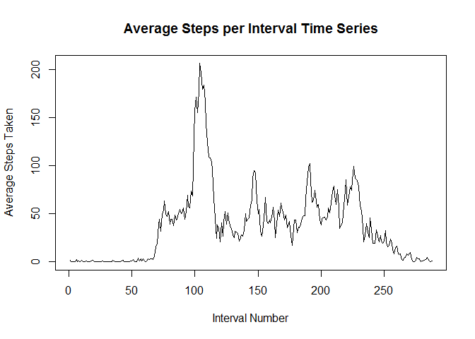
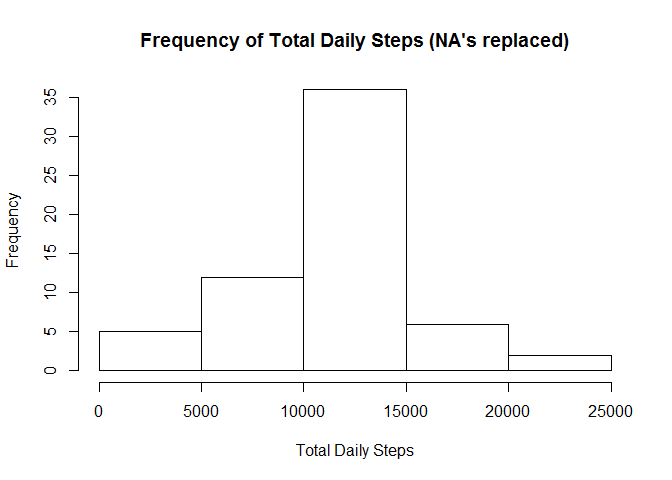
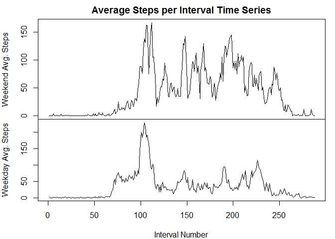

# Reproducible Research: Peer Assessment 1

##Loading and preprocessing the data


```r
activityDF <- read.csv(unz("activity.zip", "activity.csv"), header = TRUE, colClasses = c("numeric", "Date", "factor"))
```
Data is loaded from an unizpped .csv file in the same directory as the R markdown file. The columns of the data frame are predefined as numeric (steps), Date (date), and factor (interval). No further processing/transformation needed at this point.

## What is the mean total number of steps taken per day?

First a vector 'dailySteps' is generated containing the total number of steps for each day.

```r
dailySteps <- tapply(activityDF$steps, activityDF$date, FUN = sum, na.rm = TRUE)
```

Then daily steps is used to generate the histogram below:

```r
hist(dailySteps, xlab = "Total Daily Steps", main = "Frequency of Total Daily Steps")
```



The mean and median are derived from 'dailySteps' respectively:

```r
mean(dailySteps)
```

```
## [1] 9354.23
```

```r
median(dailySteps)
```

```
## [1] 10395
```

## What is the average daily activity pattern?
A vector 'intervalSteps' is derived from 'activityDF'. That vector is then ordered by intervel, then plotted as a time series:

```r
#create vector of averages by interval, then sort the vector by names attribute (interval values)
intervalSteps <- tapply(activityDF$steps, activityDF$interval, FUN = mean, na.rm = TRUE)
intervalSteps <- intervalSteps[order(as.numeric(names(intervalSteps)))]

plot(intervalSteps, type = "l", ylab = "Average Steps Taken", xlab = "Interval Number", main = "Average Steps per Interval Time Series")
```



The 5-minute interval with the highest number of average steps and its value are:

```r
#get max interval and value
intervalSteps[which(intervalSteps %in% max(intervalSteps))]
```

```
##      835 
## 206.1698
```

## Inputing missing values
The rows with missing values are any rows that are not complete cases. The total number of rows with missing values is:

```r
#missing vals
sum(!complete.cases(activityDF))
```

```
## [1] 2304
```

To adjust for missing values in the 'steps' column of the original dataset ('activityDF'), any entry with a missing value will be replaced by the mean value of its interval. The procedure for doing this is as follows:
* Copy 'activityDF' to a new data frame ('fullActivityDF')
* Add a new column ('intAverage') containing the average value for each interval to 'fullActivityDF'.
* Use the value of 'intAverage' for 'steps' wherever 'steps' is NA.

```r
#strategy is to replace each entry with its interval mean.
#copy activityDF to new data frame fullActivityDF. Add column to data frame for average interval value.
#Recycling not a concern because the original DF was ordered by day, then interval.

fullActivityDF <- activityDF
fullActivityDF$intAverage <- intervalSteps
fullActivityDF$steps[is.na(fullActivityDF$steps)] <- fullActivityDF$intAverage[is.na(fullActivityDF$steps)]
```

Once 'fullActivityDF' has been created, another vector 'fullDailySteps' is generated to hold the total steps for each day. Then 'fullDailySteps' is used to generate a histogram below:

```r
fullDailySteps <- tapply(fullActivityDF$steps, fullActivityDF$date, FUN = sum)
hist(fullDailySteps, xlab = "Total Daily Steps", main = "Frequency of Total Daily Steps (NA's replaced)")
```



The replacement of missing values with interval means appears to have normalized the histogram somewhat. Meanwhile the mean and median have both increased.

```r
mean(fullDailySteps)
```

```
## [1] 10766.19
```

```r
median(fullDailySteps)
```

```
## [1] 10766.19
```

## Are there differences in activity patterns between weekdays and weekends?

To compare the weekday vs weekend values, the function 'weekend' was defined to take a date argument and return "weekend" if that argument was a Saturday or Sunday, and return "weekday" if it wasn't.

```r
#define weeekend function
weekend <- function (x) {
  if (weekdays(x) %in% c("Saturday", "Sunday")) return("weekend")
  else return("weekday")
}
```

The weekend function was then applied over the 'fullActivityDF' to add a new factor column ('weekend').

```r
fullActivityDF$weekend <- as.factor(sapply(fullActivityDF$date, weekend))
```

NOTE: The following steps are not the most memory efficient way of solving the problem, but they allow for greater legibility and the size of the dataset is not considered prohibitive.  

'fullActivityDF' was then subset into 'weekendDF' and 'weekdayDF'.

```r
weekendDF <- subset(fullActivityDF, weekend == "weekend")
weekdayDF <- subset(fullActivityDF, weekend == "weekday")
```

The same procedure used earlier to create and sort 'intervalSteps' was used to create the vectors 'weekdaySteps' and 'weekendSteps' which contain the average number of steps taken across each interval for weekdays and weekends respectively.

```r
weekdaySteps <- tapply(weekdayDF$steps, weekdayDF$interval, FUN = mean)
weekdaySteps <- weekdaySteps[order(as.numeric(names(weekdaySteps)))]

weekendSteps <- tapply(weekendDF$steps, weekendDF$interval, FUN = mean)
weekendSteps <- weekendSteps[order(as.numeric(names(weekendSteps)))]
```

Finally the 'weekdaySteps' and 'weekendSteps' vectors were used to generate the time series comparison below:

```r
defaultPar <- par() #save current plotting parameters

par(mfrow = c(2,1), mar = c(0,4,2,1))
plot(weekendSteps, type = "l", xaxt = "n", ylab = "Weekend Avg. Steps", main = "Average Steps per Interval Time Series")
par(mar = c(4,4,0,1))
plot(weekdaySteps, type = "l", xlab = "Interval Number", ylab = "Weekday Avg. Steps")
```



```r
par(defaultPar) #restore default parameters
```

